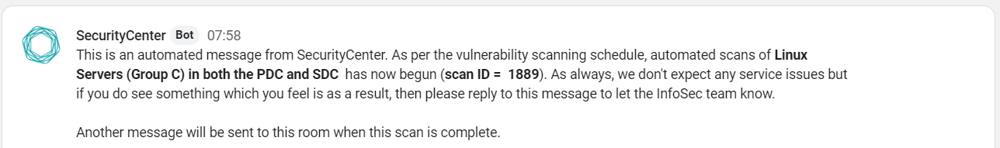
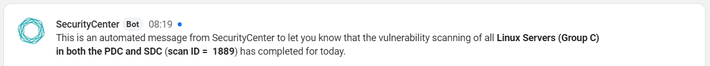

# Introduction

Here are a couple of scripts I've quickly knocked up (so to speak) to help me with automating SecurityCenter scans whilst at the same time giving the right useful information to the right people.

## Deployment
Both scripts utilise the TenableSC API wrapper to run as shown in the code snippet below:

```python 
	from tenable.sc import TenableSC
```

More information on this API wrapper can be found here: https://pytenable.readthedocs.io/en/stable/sc.html

## sc-scan-webhook
This script allows you to start predefined scans with Tenable's Security through the API, send a webhook notification message to a Google chat room, monitor for the scan to complete successfully and then sends another webhook notification message stating the scan is complete.

### Configuration
Before you can begin to run this script there's some information you need to provide it. This is information which is specific to you and your environment and you can find this in the init section of the script as shown below: 

``` python
    def __init__(self):
        self.ip = '<IP>'
        self.login = '<username>'
        self.password = '<password>'
        self.policyID = 'policy ID>'
        self.credentialID = '<credential ID>'
        self.repository = '<repo ID>'
        self.reportID = '<report ID>'
        self.email_on_launch = 'false'
        self.email_on_complete = 'false'
        self.URL = '<webhook URL>'
```

The field ```pythonself.ip = '<IP>'``` is the IP address of your SecurityCenter instance. The *self.login* and *self.password* field are for the user which authenticates to SecurityCenter to run the scans. I've created a sca-automation user for auditing purposes but feel free to choose which ever user you wish.

The field *self.policyI*D is the ID for the policy which your scan is already configured to use in SecurityCenter. Find the scan you wish to run, then on th settings tab note the name of the policy selected. Then find this policy under the Policies tab and click view to see its ID value. This is the value you need to set self.policyID to.

The field *self.credentialID* is the credential which the policy has been configured to use. 

The field *self.repositoryID* is the repo ID value which your SecurityCenter instance is using. 

The fields *self.reportID*, *self.email_on_launch* and *self.email_on_complete* are all optional fields which I've left here for future updates to the script.

The final field *self.URL* is the webhook URL of the chat room where the messages will be sent at the start of our scans and when they have completed.

### Usage
Once this information has been provided you're ready to run the script. The script needs 2 command line arguments to run. The first is the ID of the scan in SecurityCenter that you want the script to run. The second argument is the target text which will be used to send the message to the chat room to let people know what targets are being scanned. 

Here's an example:

	# python3 sc-scan-webhook 445 "Windows Server in both Primary data center and secondary data centers"

Here's a screenshot of an example webhook message sent at the start of the scan to a Google Chat room:



Here's a screenshot of an example webhook message sent when the scan has completed successfully:



## sc-getrunning.py

A script that lists scans which have a "running" state within SecurityCenter. 

##

### Versioning
v1.0 - original script
v1.01 - added day inteeligence in to sc-scan-webhook to be able modify the target text message sent based on the day of the week (DOTW)
v1.02 - remove change made in v1.1 and added a second command line argument to take in target text passed from the command line by the scheduled cron job 

### ToDo
Modify the sc-scan-webhook script to handle scans that rollover after a longer period of time.

### License
This project is licensed under the MIT license.

##
